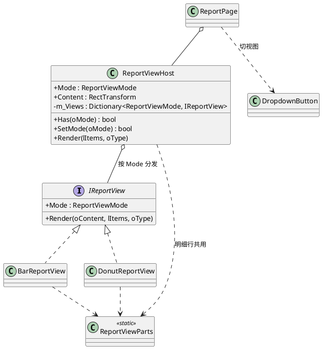

# EasyMoney.App — 应用层

**能碰 UnityEngine 和 UI 的唯一一层。** 上层没有别的东西了，下层是 Data / Core。

命名空间 `EasyMoney.App`，程序集 `EasyMoney.App`，引用 `UnityEngine.UI`。

---

## 目录

```
App/
├── EasyMoney.App.asmdef
├── AppContext.cs       单例依赖容器（库 + 三个仓储 + TransactionService）
├── AppRoot.cs          应用入口：建库 + 界面骨架 + 标签栏装配
└── UI/
    ├── Theme.cs            尺寸 / 字号 / 颜色（颜色转发给 ThemePalette）
    ├── ThemePalette.cs     配色对象，含 Light() / Dark() / FromJson()
    ├── UiFactory.cs        ★ 所有 UI 构件的工厂
    ├── SpriteFactory.cs    卡片 / 按钮底图（资源优先，程序化兜底）
    ├── FontProvider.cs     字体（按字重解析：Resources → 系统 → 内置）
    ├── AssetPaths.cs       资源路径常量
    ├── AssetProvider.cs    唯一的 Resources.Load 入口
    ├── IconNames.cs        图标名常量
    ├── SafeAreaFitter.cs   安全区适配（含底部导航栏内缩）
    ├── AndroidSystemBars.cs 读 Android 系统栏高度 / 要求导航栏常驻（JNI，非 Android 恒返回 0）
    ├── SafeAreaDiagnostics.cs ⚠️ 临时：真机诊断读数，**导航栏那轮验完即删**
    ├── PageBase.cs         页面抽象基类
    ├── PageRouter.cs       页面注册与切换
    ├── TabBar.cs           底部标签栏
    ├── TogglePalette.cs    「选中 / 未选中」配色的唯一出处（报表页收支切换、记账页类型分段）
    ├── MonthBar.cs         月份条（左右翻月 + 点年月文字选月），账单页与报表页共用
    ├── DropdownButton.cs   就地下拉浮层（按钮正下方弹面板），报表页切视图用
    ├── PickerDialog.cs     通用选择弹窗（分类 / 账户 / 日期共用）
    ├── MonthPickerDialog.cs 选择月份弹窗（年份行 + 3×4 月份网格）
    ├── AccountEditDialog.cs 账户新建 / 编辑弹窗（Task 15）
    ├── Reports/            报表主体的几种画法（见「报表视图」一节）
    │   ├── IReportView.cs      视图接口（Mode + Render）
    │   ├── ReportViewHost.cs   按当前模式分发，换视图先清场
    │   ├── ReportViewParts.cs  共用零件（明细行、空态提示）
    │   ├── BarReportView.cs    条形图
    │   ├── DonutReportView.cs  环形图 + 环中心合计
    │   └── DonutSprite.cs      环形贴图，逐像素程序化生成
    └── Pages/
        ├── RecordPage.cs
        ├── TransactionListPage.cs
        ├── AccountPage.cs
        └── ReportPage.cs
```

---

## 写一个页面

`PageBase` 是**纯类，不是 MonoBehaviour**：

```csharp
public class XxxPage : PageBase
{
    public override string Title => "标题";       // 显示在顶栏

    public override void OnShow() { _refresh(); } // 每次切到本页时调用

    protected override void _build()              // 只调用一次
    {
        // 在这里用 UiFactory 搭界面，挂在 Root 下面
    }

    private void _refresh() { /* 取数并填界面 */ }
}
```

在 `AppRoot._buildPages()` 里注册：

```csharp
_register(TABS[2].Key, new XxxPage());
```

⚠️ **`OnShow()` 不只是「切到本页」，它还是「数据变了」的回调。** `AppRoot` 订阅了
`DataChanged`，收到通知会把当前页重走一遍 `OnShow()`——**包括页面自己刚保存完喊的那一声**。
所以在 `OnShow` 里无条件重置表单是错的：用户刚选好的分类、账户会被自己那次保存冲掉。

`RecordPage` 是这么处理的：`m_Initialized` 让**首次**进入才做整页重置，之后 `OnShow`
只补「还没选」的项（顺带兜住「新装的库里没有账户，去建完再切回来」那个场景）。
保存成功后也只清金额与备注，类型 / 账户 / 分类 / 日期都留着——「连着记几笔同类账」
（一天几笔餐饮）时那几项通常一样，每笔都要重选一遍很烦。

⚠️ 这条行为**没有测试覆盖**：`_onSave` 要连着 `AppContext` 和数据库才走得完，
EditMode 够不着。不为它造测不了的抽象，改由 Play 肉眼验收。

---

## UiFactory 布局约定（★ 最容易踩坑的地方）

### 纵向容器 Column
`childControlHeight = true` —— 子元素靠 `LayoutElement.preferredHeight` 定高，宽度自动撑满。

```csharp
RectTransform oCol = UiFactory.CreateColumn(parent, "Col", spacing: 12f);
UiFactory.SetHeight(child, 112f);
```

- `CreateColumn` —— 定高容器
- `CreateAutoColumn` —— 高度随内容自适应（放进滚动区用）
- `CreateTopColumn` —— 贴顶定高（页面顶部区域用）
- `CreateCard` —— 白底圆角卡片，高度自适应

### 横向容器 Row
`childControlWidth = true` —— 子元素靠 `preferredWidth` 定宽、`flexibleWidth = 1` 占满剩余。

```csharp
RectTransform oRow = UiFactory.CreateRow(parent, "Row", fHeight: 112f);
UiFactory.SetWidth(left, 140f);       // 定宽
UiFactory.SetFlexible(right);         // 吃掉剩余
```

- `CreateRow` —— 定高、白底圆角、左右带 `CARD_PADDING` 内边距（列表项/表单行的标准形态）
- `CreateBareRow` —— 定高、不带内边距（卡片内部用，避免与卡片内边距叠加）
- `CreateRowContainer` —— 纯横向容器，无高度无内边距

### 滚动区
`CreateScroll(parent, name, out content)`，四个页面和 `PickerDialog` 共用。

- **滚动区自己铺满父容器**，不用调用方 `Stretch`。父容器可以是页面主体，
  也可以是弹窗里已经定好位的列表区
- **返回的 `content` 是内容容器**，已经左右各缩进一个 `PAGE_PADDING`，
  宽度不用自己算；往里塞 `CreateAutoColumn` 之类的自适应高度容器即可
- Viewport 上挂了 `RectMask2D`，**超出部分真的会被裁掉**——滚动区尺寸算错不会报错，
  只会让文字少半截

同名的 `UiFactoryLayoutTests` 锁着这个契约（`Assets/Tests/EditMode/`）。
它只断言锚点能即时决定的尺寸，布局组算出的高度测不了，那些仍要靠 Play 肉眼验。

### ⚠️ 四个已知陷阱

**1. 一个节点上不要同时挂两种 LayoutGroup。**
`HorizontalLayoutGroup` + `VerticalLayoutGroup` 会打架。
需要「上面文字、下面条形」这种竖排结构时，用 `CreateNode` + 手动 `AddComponent<VerticalLayoutGroup>()`，
**不要**先 `CreateRow` 再 `Destroy` 掉它的 HorizontalLayoutGroup——
`Destroy` 延迟到帧末执行，同一帧内两个布局组会共存。

**2. 锚点驱动和布局驱动不要混用。**
父节点有 LayoutGroup 时，子节点的 `anchorMin/anchorMax/anchoredPosition` 会被布局系统覆盖。
想让一个元素参与布局，就把它作为正常子元素加进去（用 `LayoutElement` 控制尺寸），
不要用 `AnchorBottom` 之类去定位。

**3. `Theme` 的颜色是属性，不是字段。**
`Theme.PRIMARY` 每次访问都会走一层属性转发。构建 UI 时无所谓，
但别放在每帧执行的循环里。

**4. 铺满整屏的东西挂 `Canvas`，别挂进 `SafeArea`；底部让多少也别自己算。**
全局 `Background` 必须在 `Canvas` 下——`SafeAreaFitter` 会让开底部导航栏，背景跟着
一起缩的话导航栏那一条就没人画了，露出相机的清屏色（比内容被挡还难看，而且会让人
以为是安全区算错了）。

底部到底让出多少，由 `Core/Layout/SafeAreaLayout.cs` 的**差额**规则决定，
**别在别处再写一遍「减掉导航栏高度」**：Unity 2022.3 的 `Screen.safeArea` 不包含
导航栏（UUM-121413），但 Android 13/14 上它**本来就排除了**导航栏——无条件减会在
那些机器上多出一条与导航栏等高的白边。两种错都不报错、不崩溃，界面上看着都「挺正常」。

导航栏高度只能从 `AndroidSystemBars` 取，并且**不要改成每帧调用**：每读一次要新建
若干个 `AndroidJavaObject`，各占一个 JNI local ref，而本地引用表只有 512 项。

底部留多少还要看**导航模式**：三键导航留整条，**手势导航留 0**（标签栏落到底，
微信就是这样）。分辨办法是 `WindowInsets.Type.tappableElement()` 的 bottom
**为 0 就是手势**（没有可点的系统栏），规则在 `SafeAreaLayout.ResolveBottomInset`。
光看导航栏 inset 分不出模式——某些机型手势下照样报三键的 48dp，留了就凭空多一条空白。

**还有一个陷阱：导航栏 inset 有值 ≠ 那一条还在渲染面里。** 关掉「Start in Fullscreen
Mode」之后窗口自己就停在导航栏上沿了（实测 2400 的屏上 `Screen.height` 报 2276），
可 `getInsets(navigationBars())` **照样报 124**——照着它再让一次，现象是
「内容整体偏高、标签栏下面空一块」。判据是渲染面底边到屏幕底边的**间距够不够一整条**
（`AndroidSystemBars` 里那个 `_windowBottomGapPx()`，读 `Display.main.systemHeight`
与 `Screen.height` 的差）。`ResolveBottomInset` 三个参数缺一不可。

导航栏的**图标颜色**也要管：Android 15 的导航栏是没有底色的浮层，图标颜色由系统按
`windowLightNavigationBar` 定，而 Unity 生成的主题继承自 `Holo.Light`——**Holo 是
API 27 之前的东西，没有这个属性**，默认 false = 画白图标。白图标落在本项目的燕麦米白
底色上就是隐形，界面上看着像「底部空了一块」。**只在 API 30+ 做**——Android 11
以下的导航栏还是不透明黑条，在那里设「浅色导航栏」会把图标变成黑图标画黑底。

`AndroidSystemBars.EnsureNavigationBarUsable()` 除了改图标颜色，还要求系统
`show()` + 不要自动隐藏，**调用点在 `SafeAreaFitter._apply()`，不是启动时调一次**。
理由：Unity 的播放器自己会给窗口设全屏沉浸标志（Player Settings 的
「Start in Fullscreen Mode」→ 清单里的 `unity.launch-fullscreen` →
`SYSTEM_UI_FLAG_HIDE_NAVIGATION | IMMERSIVE_STICKY`），而它设的时机在我们后面——
只调一次会被盖掉，真机现象是导航键「露一下、慢慢消失、划一下才浮出来、一两秒又缩回去」。
`_apply()` 在启动头两秒会反复跑、切回前台也会跑，正好覆盖那两个时间点。
⚠️ 那个 Player Setting **必须是关的**（`AndroidPlayerSettingsTests.StartInFullscreen_IsDisabled` 守着）。

---

## 平台相关代码：用 `#if UNITY_ANDROID`，别用 `#if UNITY_ANDROID && !UNITY_EDITOR`

```csharp
// ✅ 这样写
public static int BottomInsetPx()
{
#if UNITY_ANDROID
    if (Application.isEditor) { return 0; }   // 运行时早返回，不是编译期排除
    return _readBottomInsetPx();
#else
    return 0;
#endif
}
```

**加了 `!UNITY_EDITOR` 就等于把这段代码从编辑器编译里摘出去**，于是里面任何编译错误
——漏 `using`、方法名写错、类型不存在——**只有真机打包时才会暴露**，代价是白跑一轮
十几分钟的构建。这个坑**已经踩过一次**：`AndroidSystemBars._bottomInset`
用了 Core 的 `SafeAreaLayout` 却漏了 `using EasyMoney.Core`，
**364 个 EditMode 用例全绿**，打包时才报 `CS0103`。

⚠️ **记住这句话：EditMode 全绿 ≠ Android 编得过。** 测试跑在编辑器平台上，
`UNITY_ANDROID` 没定义，被 `#if` 摘掉的代码它一行都没看过。
所以**动了 `#if UNITY_ANDROID` 里的东西，「再来一轮测试」不算验证，得真打一次包**。

改成 `#if UNITY_ANDROID` 之后，只要当前 Build Target 是 Android（本项目一直是），
编辑器就会把这段代码一起编译，写错当场发现；执行路径由 `Application.isEditor` 挡住。
**残留的边界**：Build Target 切成非 Android 时这段仍不编译——别长期切走。

同一条纪律也适用于方法的**位置**：`#if` 块里的方法，块外的调用方看不到。
`AndroidSystemBars` 那几个诊断方法与 `BottomInsetPx` 一样，外壳在 `#if` 外、
实现放里面——把整个方法塞进块内，块外的调用方直接 CS0117。这个错犯过两次。

---

## 字重怎么给（★ 别写 `FontWeight.XXX` 字面量）

`UiFactory` 每个建 Text 的工厂方法（`CreateText` / `CreateButton` / `CreateIconOrText` /
`CreateIconTextButton` / `CreateTabButton` / `CreateInput`）**末尾**都有一个

```csharp
FontWeight eWeight = FontWeight.Regular
```

参数，往后加是为了不破坏全站约 60 个位置参数调用点。**页面里一律传 `Theme.WEIGHT_*`**，
不写字面量——理由同「页面里不许出现写死的颜色字号」：

| 语义常量 | 值 | 用在哪 |
|---|---|---|
| `Theme.WEIGHT_AMOUNT` | Medium | 金额数字（记账框、总资产、列表行金额、各类汇总） |
| `Theme.WEIGHT_TITLE` | Medium | 标题（页标题、月份、弹窗标题） |
| `Theme.WEIGHT_STRONG` | Bold | 主操作按钮（保存、添加账户） |
| `Theme.WEIGHT_BODY` | Regular | 正文与次要说明 **（就是默认值，不用显式传）** |

⚠️ **金额输入框的占位符和可编辑文本是两个 `Text`，共用同一个 `iFontSize`。**
`UiFactory.CreateInput` 会把字重一起给到两边；自己另建 InputField 时忘了给
placeholder，就会出现「一聚焦占位符变粗、一输入又变细」的跳动。

⚠️ **`fontStyle` 不要再写。** 全项目唯一写过它的 `TabBar` 已改成切换真字体文件——
Unity 的合成粗体是给笔画描边，小字号中文会糊。缺字体文件时 `FontProvider` 退回
Regular，不会退回合成粗体。

`FontProvider.Resolve(FontWeight)` 按字重缓存；`Reset()` 清缓存（改完资源配置后调）。
字重→槽位名的映射在 `Core/Typography/FontSlots.cs`，`FontSlotsTests` 盯着。

---

## 页面怎么取数

**唯一的取数点是各页面的 `_refresh()`。** 四个页面都接完了，随便挑一个当范例。

```csharp
private void _refresh()
{
    // 先向仓储取数，再交给 Core 的纯函数算
    List<Transaction> lTxs = AppContext.Instance.Transactions.Query(
        new TransactionQuery { StartMs = iStartMs, EndMs = iEndMs, Limit = 1000 });
    PeriodSummary oSummary = ReportCalculator.BuildSummary(lTxs);
    m_IncomeValue.text = oSummary.Income.ToString();   // Money.ToString() → "35.50"
}
```

⚠️ **`TransactionQuery.Limit` 默认只有 50**，而且超了不报错、只是结果变少。
按月取数就得显式抬高（`TransactionListPage` 与 `ReportPage` 都用 1000）。这个坑很隐蔽：
界面不崩，只是「某个月少了几十条记录」。

`AppContext` 已经在位：`AppContext.Instance` 由 `AppRoot` 在 `Awake` 里初始化，
页面只管用。

页面**不用自己订阅 `DataChanged`**——`AppRoot` 已经统一订阅，收到通知后重走当前页的
`OnShow()`。写数据的一方负责在落库成功后喊一声：

```csharp
oContext.NotifyDataChanged();
```

页面里**只做展示和取数调用**，不要写业务逻辑。校验、聚合都在 Core / Data 层。

更要紧的是：**「一条账单该怎么显示」这种规则也别写在页面里。** 备注为空时显示分类名、
转账不带正负号、分类被删了显示「未分类」——这些是业务约定，不是版式。`TransactionListPage`
把它们放在 `Core/Statements/StatementBuilder.cs`，页面只拿现成的 `Title / Subtitle /
AmountText` 往 `Text` 里塞。理由很实在：EditMode 测试根本跑不到页面，规则留在页面里就只能
靠肉眼看；抽成纯函数才能被 `StatementBuilderTests` 逐条盯住。Task 15 也照这个来：
`AccountEditDialog` 只摆控件，`Core/Accounts/AccountForm.cs` 管类型标签与表单校验
（`AccountFormTests`）。Task 16 同理：`ReportPage` 只摆控件，`Core/Reports/ReportForm.cs`
管构成标题、占比文案与条形宽度（`ReportFormTests`）。

页面之间重复的写法也该往上收：月份标题原先账单页与报表页各拼一遍，现在统一走
`TimeUtil.FormatYearMonth`。同一条月份条（左右箭头 + 年月文字）原先两页各写一份，
**连三个常量都各定义一遍**，现在已经收成 `App/UI/MonthBar.cs`——记账页与报表页各
`new MonthBar(oTop, Root, _refresh)` 一行，年月由它持有，页面通过 `m_MonthBar.Year` /
`.Month` 取数。

⚠️ 收成组件还有一层好处：**页面里的代码 EditMode 测试够不着，组件够得着**。
月份条的翻页、跨年进位、文案、点开弹窗选月，现在有 `MonthBarTests` 10 个用例盯着
（在这之前一条都没有）。往页面里加逻辑前，先想想能不能这样提到组件里。

弹窗里还有个容易写错的点：**不要就地改传进来的 `Account`**。它是引用类型，就地改会让
「点取消」变成改了一半的假取消——表单状态放局部变量，点保存再组装一个新对象写库。

---

## 选中态配色：一律走 TogglePalette

「一排按钮，选中的那个高亮」这种控件（报表页的支出/收入构成、记账页的支出/收入/转账）
一律用：

```csharp
TogglePalette.Apply(m_ExpenseTab, bExpense);
TogglePalette.Apply(m_IncomeTab, !bExpense);
```

**别自己拼 `bSelected ? Theme.PRIMARY : Theme.SURFACE` 那种三元表达式。**

这不是洁癖。原先那段样板在报表页与记账页各抄了一遍，抄第二遍时把收入按钮未选中态的
「暖白底 + 深字」写成了「暖白底 + 白字」——不报错、不崩溃、当时也没有测试，
只是那个按钮看上去「**没有文字**」。收成一处之后，调用方传的是「选没选中」而不是
两组颜色，这类抄错结构性地不可能再犯。

`TogglePaletteTests` 钉着这套规则，其中两条用 **WCAG 对比度**（AA 对 UI 组件要求
3:1）而不是「等于某个常量」——「底色和字色各自都合法、配在一起却看不见」正是这个
bug 的形状，只断言常量的话把两个常量一起写错就漏过去了。写新配色时沿用这个断言方式。

⚠️ **选择月份弹窗（`MonthPickerDialog`）的格子不走这里**：它的未选中底用页面底色
而不是卡片色——弹窗本身就是卡片，格子再用卡片色就分不出来了。那是另一种场景，
不是这条规则漏了一个调用方。

---

## 换资源改哪里

| 想改什么 | 改哪里 |
|---|---|
| 尺寸、间距、字号 | `Theme.cs` 上半部分（都是 `const`） |
| 配色 | `Assets/Resources/theme.json` 或 `ThemePalette.cs` |
| 图标名字 | `IconNames.cs` |
| 新增具名资源 | `AssetPaths.cs` |
| 加载逻辑 | `AssetProvider.cs` |
| 组件样式（按钮/卡片/滚动区长什么样） | `UiFactory.cs` |
| 圆角兜底图形的画法 | `SpriteFactory.cs` |
| 系统字体候选顺序 | `FontProvider.cs` |

**页面代码里不应该出现任何写死的颜色、字号或图片路径。**
如果发现要改页面才能换资源，那是个 bug——把那个东西挪进 `Theme` 或 `IconNames`。

---

## 图标 API

```csharp
// 图标（找不到返回 null）
Image oIcon = UiFactory.CreateIcon(parent, "Icon", IconNames.ADD, 48f, Theme.PRIMARY);

// 图标或文字兜底（翻页箭头、行尾 chevron）
UiFactory.CreateIconOrText(parent, "Chevron", IconNames.CHEVRON_RIGHT, ">",
    44f, Theme.FONT_BODY, Theme.TEXT_WEAK);

// 底部标签（图标在上、文字在下）
UiFactory.CreateTabButton(parent, "Tab_x", IconNames.TAB_LIST, "账单", onClick);

// 左图标 + 右文字（「+ 添加账户」）
UiFactory.CreateIconTextButton(parent, "Add", IconNames.ADD, "添加账户", onClick,
    Theme.PRIMARY, Theme.WHITE, Theme.FONT_TITLE, "+ 添加账户");   // 末参是兜底文字

// 把已有按钮的文字标签换成图标
UiFactory.ReplaceButtonLabelWithIcon(oButton, IconNames.CHEVRON_LEFT, 40f, Theme.PRIMARY);

// 列表行首的图标位：有图放图，没图留一个等宽空位（不画）
Image oSlot = UiFactory.CreateIconSlot(oRow, "Icon",
    IconNames.ForCategory(oStatementRow.CategoryIconName),
    Theme.CATEGORY_ICON_SIZE, Theme.TEXT_WEAK);
UiFactory.SetIconSlot(oSlot, IconNames.ForCategory(oCategory?.IconName), Theme.TEXT_WEAK);
```

有了图标之后要改按钮配色，用 `UiFactory.GetButtonIcon(oButton)` 拿到 Image。

**`CreateIconSlot` / `SetIconSlot` 与 `CreateIconOrText` 的分工**：

| | 没图标时 | 返回 | 用来 |
|---|---|---|---|
| `CreateIconOrText` | 建一个 Text 显示兜底文字 | `RectTransform` | 翻页箭头、行尾 chevron——光秃秃一个箭头没了就没法点 |
| `CreateIconSlot` | 整格透明，**位置留着** | `Image` | 列表行首——宁可空一格，也不能让各行文字左边缘参差不齐 |

`CreateIconSlot` 返回 `Image` 而不是 `RectTransform`，是为了能**就地换图**：
记账页选中分类后要往同一格里填图，若改成重建节点，`Destroy` 延迟到帧末，
新旧两个节点会在同一帧的布局里各占一格。要换图一律走 `SetIconSlot`，不要自己
`Destroy` + 重建。

分类图标名是**数据**（存在 `category.icon_name`），解析一律用
`IconNames.ForCategory(...)`——它会检查资源真实存在，找不到返回 `null`，
`SetIconSlot` 拿到 `null` 就把整格调透明。

---

## 卡片

列表行、账户行、报表行这些「圆角卡片底」统一用 `UiFactory.PaintCard`：

```csharp
UiFactory.PaintCard(oRow);   // 圆角 + 卡片色 + 一层投影
```

**别自己写 `AddComponent<Image>` + `SpriteFactory.Card()` + `Sliced`**——这段样板
曾经在三个页面里各抄一遍，加投影时就得改三处，漏一处那块卡片就平贴在底色上，
而且从代码里完全看不出来。

投影走 `UiFactory.AddCardShadow`（UGUI 的 `Shadow` 组件），画在**节点之外**，
不动任何布局尺寸。把投影烘进底图是不行的：九宫格的 border 必须连它一起包住，
图被拉伸到节点尺寸时卡片本体就比节点小一圈，行高、内边距、行间距全得跟着重量一遍。
代价是 `Shadow` 只偏移不模糊、边缘偏硬——想要柔和投影就给美术一张 `card.png`，
`AssetProvider` 会优先用图。

⚠️ **卡片色和页面底色只差十几个色阶**（暖色纸感就是这么设计的），两者的边界
全靠这层投影交代。调整用 `Theme.SHADOW` / `Theme.SHADOW_OFFSET`，
色值来自 `Resources/theme.json` 的 `shadow` 键。

**并不是所有白底都该有投影**：账单页的月份条、汇总条是直角纯色条，标签栏和标题栏
也是——它们是「栏」不是「卡片」，`PaintCard` 只给真正的卡片用。

---

## 选择弹窗

「弹一个列表让用户挑」的交互统一走 `PickerDialog`，不要各写一套：

```csharp
PickerDialog.Show(Root, "选择分类", lLabels, iIndex => { _pick(lCategories[iIndex]); },
    "还没有分类，请先去「账户」页添加");
```

- 第四个参数是选中回调，拿到的是**下标**，不是对象——调用方自己索引回原列表
- 第五个参数是列表为空时的文案，省略则显示「暂无可选项」
- 弹窗挂在传入的父节点下（通常就是页面 `Root`），选完或取消后自行销毁

要带图标的重载，把图标名列表插在选项列表后面：

```csharp
PickerDialog.Show(Root, "选择分类", lLabels, lIcons,
    iIndex => _pickCategory(lCategories[iIndex]), "还没有分类，请先去「账户」页检查");
```

- 图标名列表可以是 `null`（走原重载，不建图标位），元素也可以是 `null`（该项留空位）
- **解析放调用方，不放 PickerDialog**：它是分类/账户/日期/类型共用的通用弹窗，
  让它认识「分类图标」这个概念是错的耦合。页面解析好名字传进来
- 一旦传了列表，**所有行都建图标位**，跟当前这项有没有图无关——否则同一弹窗里
  有图的项和没图的项文字左边缘会错开

### 三个弹窗怎么分工

| 弹窗 | 形状 | 什么时候用 |
|---|---|---|
| `PickerDialog` | **不定长的一列选项** + 滚动，当前项打勾 | 分类 / 账户 / 日期 / 类型——选项多寡不定 |
| `MonthPickerDialog` | **固定的 3×4 月份网格** + 顶部年份翻页 | 只给「选到某年某月」用，通常由 `MonthBar` 拉起 |
| `AccountEditDialog` | 表单（输入框 + 类型分段 + 保存/取消） | 账户的新建与编辑 |

别把月份网格塞进 `PickerDialog`——「不定长滚动列表」与「固定网格 + 年份翻页」
是两种形状，硬塞会把两边都搞乱。`MonthPickerDialog` 也**不并进 `MonthBar`**：
`MonthBar` 是常驻的条，弹窗是随用随建的覆盖层，生命周期不一样。

⚠️ **关弹窗一律走 `Object.Destroy`，它在 EditMode 下是非法的**（直接打一条 Error
并且什么都不做，不是延迟到帧末）。所以 EditMode 测试里点到「会关弹窗」的那一下，
必须先 `LogAssert.Expect` 声明这条错误日志，否则测试会被判失败——
`MonthPickerDialogTests._expectEditModeDestroy` 就是这么做的。真机跑 Play 模式，没这回事。

---

## 报表视图（下拉切换）

报表主体有几种画法（现在两种：条形图、环形图），顶上挂一个下拉切换。结构是
「接口 + 宿主 + 各自实现」：



### 新增一种视图

1. `Core/Reports/ReportViewMode.cs`：枚举加一项，`ReportViews.ALL` 加一项，
   标题常量加一个
2. `App/UI/Reports/` 下写一个类实现 `IReportView`
3. `ReportPage._buildBreakdownArea` 里 `new ReportViewHost(...)` 多传一个实例

**页面别处不用动**——下拉选项、标题、下标映射全部来自 `ReportViews.ALL`。
步骤 1 漏了 `ALL` 或步骤 3 漏了实现，`ReportViewHostTests.EveryModeInCatalog_HasAView`
会红：下拉里多出一个点了没反应的选项，从界面上很难归因。

⚠️ **视图之间不共用节点，`Render` 开头一律先清场**（`UiFactory.ClearChildren`）。
视图各建各的节点、直接挂在同一个 `content` 下，不清的话新旧两批会同时参与布局——
看着就是「两个视图叠在一起」，不报错。`ReportViewHostTests` 有两条用例钉着。

### `UiFactory.DestroyObject` / `DestroyNode` / `ClearChildren`

新代码要销毁节点时用这三个，**不要直接写 `Object.Destroy`**：

```csharp
UiFactory.DestroyNode(oNode.gameObject);   // 单个节点
UiFactory.ClearChildren(oContent);         // 清空一个容器的子节点（倒着删）
```

理由是 `Object.Destroy` 在 EditMode 下**非法**——打一条 Error 并且什么都不做。
`DestroyObject` 在 `Application.isPlaying` 为假时改走 `Object.DestroyImmediate`，
于是「切视图要清掉旧节点」这种**销毁本身就是被测行为**的场景才验得了。

⚠️ 这是对「生产代码保持 `Object.Destroy`，EditMode 的非法性由测试侧
`LogAssert.Expect` 吸收」那条约定的一次**有意偏离**，只对新代码生效：
约定针对的是弹窗，那里「销毁」不可观测、吸收掉就完了；这里不行。
`PickerDialog` / `MonthPickerDialog` / `AccountEditDialog` 仍按原样不动。

### 图表色板

环形图按分类序号取色，用 `Theme.ChartColor(i)`（下标越界会自动回绕，负数也行）。
**色板不从 `theme.json` 读**——它是一组要能互相区分的颜色，不是单值配色；
`ThemePaletteTests` 有一条用例专门钉住「改 `theme.json` 不影响它」。

⚠️ **色点（图例）必须跟行号取色，不能跟 `CategoryId`。** 环上没有文字，颜色与分类
的对应全靠明细行最左那个小圆点（`ReportViewParts` 的 `Dot` 节点，圆底图来自
`SpriteFactory.Circle()`）。而扇区是按行号取色的（`DonutLayout` 里 `SeriesIndex = i`）——
色点要是跟着 `CategoryId` 走，中间删掉一个分类，颜色就整体错位了，环和行都还在、
只是对不上，从界面上很难归因。`ReportViewRenderTests` 有一条专门拿 `CategoryId` 77/88
的输入钉这个。

`AddRow` 的 `iSeriesIndex` 传负数表示这个视图不要图例。条形图传的就是 `-1`：
它的条统一用收支红绿、不按分类分色，旁边再来个按分类变的色点会跟条的颜色对不上。

⚠️ **环形贴图是原生对象**（`Texture2D` + `Sprite`），`DonutSprite` 每次重画前都会
先释放上一张。切月份、切收支、切视图都会重画——不释放的话显存一路涨而且不报错。
加新的程序化贴图时照抄这个模式。

---

## 注意事项

- **`.meta` 文件必须一起提交**
- 改完代码在 Unity Console 确认无编译报错（命令行编译常因编辑器占用跑不了）
- 新增资源目录时记得放 `.gitkeep`，否则 git 不跟踪空目录
